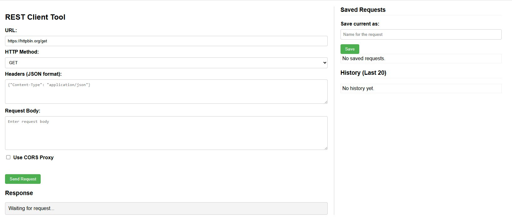

# Web-Based REST Client Tool
A simple web-based tool built with Flask and vanilla JavaScript for testing REST APIs directly from your browser. This tool allows you to send various types of HTTP requests, save frequently used request configurations for easy reuse, and view a history of your recent requests.



## Features

*   **Send HTTP Requests:** Supports GET, POST, PUT, DELETE, PATCH, OPTIONS.
*   **Custom Requests:** Specify URL, HTTP method, custom Headers (in JSON format), and Request Body.
*   **Save & Load Requests:**
    *   Save the current configuration (URL, method, headers, body, proxy setting) with a unique name.
    *   List all saved requests.
    *   Easily load a saved configuration into the form.
    *   Delete saved requests that are no longer needed.
*   **Request History:**
    *   View a list of the most recent requests you've made (limited number).
    *   Easily load a previous request from the history into the form.
*   **Response Viewer:** See the Status Code, Response Headers, and Response Body from the API.
*   **CORS Proxy:** Simple built-in proxy feature to bypass CORS issues during local testing (activated via checkbox).
*   **Persistent Storage:** Saved requests and history are stored locally in JSON files (`saved_requests.json` and `request_history.json`).

## Prerequisites

*   Python 3.x
*   `pip` (Python package installer)

## Installation and Running

1.  **Clone the repository (or download the files):**
    ```bash
    # If using git
    git clone <your-repo-link>
    cd <repo-name>

    # Or manually download app.py and place it in a directory
    cd /path/to/your/directory
    ```

2.  **Install dependencies:**
    The tool uses Flask and Requests. Install them via pip:
    ```bash
    pip install Flask requests
    ```
    *(If using a virtual environment (recommended), activate it first)*

3.  **Run the application:**
    ```bash
    python app.py
    ```

4.  **Open in your browser:**
    By default, the application runs at `http://127.0.0.1:5000`. Open this address in your web browser.

    *Note:* The files `saved_requests.json` and `request_history.json` will be automatically created in the same directory where `app.py` is run, the first time data is saved or a request is made.

## Usage

### Sending a Request

1.  Fill in the **URL** for the API endpoint.
2.  Select the **HTTP Method** from the dropdown list.
3.  Enter any necessary **Headers** in JSON format (e.g., `{"Content-Type": "application/json", "Authorization": "Bearer YOUR_TOKEN"}`). Leave empty if no specific headers are needed.
4.  Enter the **Request Body** in the textarea, if applicable.
5.  Check **Use CORS-Proxy** if you are testing against an API that blocks requests from `localhost` due to CORS policy.
6.  Click **Send Request**.
7.  The response (status code, headers, body) will be displayed in the **Response** box at the bottom.

### Saving a Request

1.  Fill the form with the settings you want to save.
2.  Enter a unique **name** for the request in the input field under "Save current as:" in the sidebar.
3.  Click **Save**. The request will be added to the "Saved Requests" list.

### Loading a Saved Request

1.  Find the request you want to load in the "Saved Requests" list in the sidebar.
2.  Click the **Load** button next to its name. The form fields will be automatically populated with the saved settings.

### Deleting a Saved Request

1.  Find the request you want to delete in the "Saved Requests" list.
2.  Click the **Delete** button. You will be asked for confirmation before the request is permanently removed.

### Using the History

1.  Each time you click "Send Request", the request's configuration is added to the top of the "History" list in the sidebar.
2.  To reuse a previous request, find it in the history and click **Load**. The form will be populated with the settings from that historical request.

## File Structure
.
├── o3rest.py # Main file with Flask app and HTML/JS
├── run.bat # Batchfile for Windows launch
├── saved_requests.json # Stores saved request configurations (auto-created)
├── request_history.json #  Stores request history (auto-created)
├── LICENSE # The GNU GPL v3 License file
└── README.md # This file
## Technical Overview

*   **Backend:** Flask (Python) handles serving the HTML/JS, receiving request details from the client, performing the actual HTTP requests using the `requests` library, and managing API endpoints for saving/loading/deleting configurations and history.
*   **Frontend:** HTML for structure, CSS for basic styling, and vanilla JavaScript to handle form interactions, make `fetch` calls to the Flask backend's API endpoints, and dynamically update the UI (response area, lists for saved requests and history).
*   **Data Storage:** Simple persistence is achieved by reading from and writing to local JSON files.

## Contributing

Pull requests and suggestions for improvements are welcome. For major changes, please open an issue first to discuss what you would like to change.

## License

This project is licensed under the GNU General Public License v3.0 - see the [LICENSE](LICENSE) file for details.